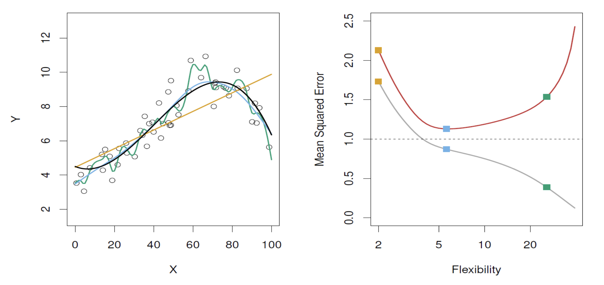
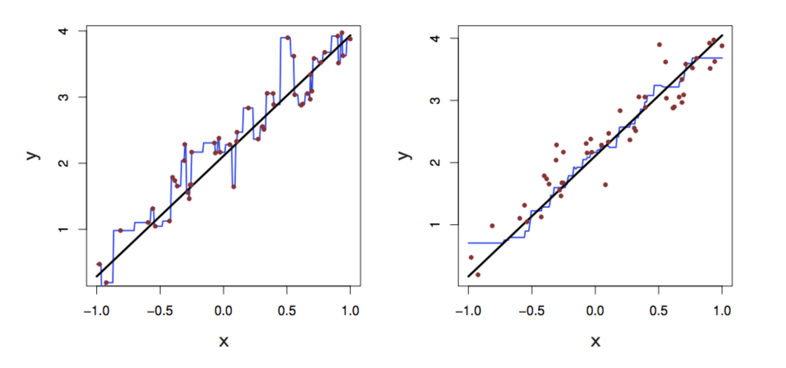

# Regression
Given a set of variables $X$, we want to predict a target variable $Y$. There's an unknown function $f$ that maps $X$ to $Y$.

We assume that $Y = f(X) + \epsilon$ where $\epsilon$ is the noise. $f(X)$ is an optimal function that minimizes the error.
The random error term $\epsilon$ is assumed to be independent of $X$ and has a mean of 0 and cannot be reduced by any model.

The optimal function $f(X)$ is the one that minimizes the error. The error is defined as the difference between the predicted value and the actual value.

## Parametric Methods
Parametric methods assume a specific form for the function $f(X)$. Involve two steps:
1. We assume a form for $f(X)$.

$$f(X) = \beta_0 + \beta_1 X_1 + \beta_2 X_2 + \ldots + \beta_p X_p$$

2. Using training data, we find the parameters of $f(X)$ that minimize the error.

Because of the restricted flexibility of parametric methods, they are open to underfitting.

**Underfitting**: The model is too simple to capture the relationship between $X$ and $Y$.

## Non-Parametric Methods
Non-parametric methods do not assume a specific form for the function $f(X)$. They are flexible and can capture complex relationships between $X$ and $Y$, however they require more data to estimate the function. They are open to overfitting.

**Overfitting**: The model corresponds too close to the training data and fails to generalize to new data.

## Assesing
- Mean Squared Error (MSE): $$\text{MSE} = \frac{1}{N} \sum_{i=1}^{N} (y_i - \hat{y}_i)^2$$

Examples:

## Bias-Variance Tradeoff
The expected error of a model is the sum of three components:
- Bias: The error due to the model's inability to capture the relationship between $X$ and $Y$.
- Variance: The error due to the model's sensitivity to the training data.
- Irreducible Error: The error due to the noise in the data.

$$\text{Expected Error} = \text{Bias}^2 + \text{Variance} + \text{Irreducible Error}$$

## Linear Regression
The linear regression model assumes a linear relationship between $X$ and $Y$. We assume a true dependency:
$$Y = \beta_0 + \beta_1 X_1 + \beta_2 X_2 + \ldots + \beta_p X_p + \epsilon$$

Assesing the model:
- Residuals: $y_i - \hat{y}_i$
- Residual Sum of Squares (RSS): $\sum_{i=1}^{N} (y_i - \hat{y}_i)^2$
- Residual Standard Error (RSE): $\sqrt{\frac{\text{RSS}}{N-2}}$

RSE is the standard deviation of the residuals, or the irreducible error epsilon.

- R-squared: $R^2 = 1 - \frac{\text{RSS}}{\text{TSS}}$
- Total Sum of Squares: $\text{TSS} = \sum_{i=1}^{N} (y_i - \bar{y})^2$

### Additive Assumption
The effect of any variable is independent of the values of the effects of other variables.

To avoid the additive assumption, we can use interaction terms. We move from the model:
$$Y = \beta_0 + \beta_1 X_1 + \beta_2 X_2 + \epsilon$$
To the model:
$$Y = \beta_0 + \beta_1 X_1 + \beta_2 X_2 + \beta_{12} X_1 X_2 + \epsilon$$

The interaction term introduces a non-linear relationship between $X_1$ and $X_2$.

## Shrinkage Methods
Shrinkage methods reduce the variance of the model by shrinking the coefficients of the variables.

### Ridge Regression
Ridge regression adds a penalty term to the RSS:
$$\text{RSS} + \lambda \sum_{i=1}^{p} \beta_i^2$$

Where $\lambda$ is the regularization parameter.

The Ridge Regression model is:
$$\hat{\beta} = (X^T X + \lambda I)^{-1} X^T y$$

### Lasso Regression
Lasso regression adds a penalty term to the RSS:
$$\text{RSS} + \lambda \sum_{i=1}^{p} |\beta_i|$$

This has the effect of forcing some of the coefficients to zero. So the Lasso performs feature selection.

## KNN Regression
KNN regression is a non-parametric method that uses the k-nearest neighbors to predict the value of a new point.

The KNN model is:
$$\hat{y} = \frac{1}{k} \sum_{i=1}^{k} y_i$$

The value of k is a hyperparameter that needs to be tuned. If k is small, then more flexible is the regression model.

Example when K=1 and K=9:

But this regression is not so good in high dimensions.

## Decision Tree Regression
The decision tree regression model is a non-parametric method that uses a tree to predict the value of a new point.

Regression tree is learned by minimizing the RSS:

$$\text{RSS} =\sum_{j=1}^{J} \sum_{i \in R_j} (y_i - \hat{y}_j)^2$$

Where $R_j$ is the number of regions in the tree.

Regression Trees are sensitive to overfitting. To avoid this, we can use pruning. There are two approaches:
1. Pre-pruning: Stop the tree before it overfits.
2. Post-pruning: Prune the tree after it overfits.

Model Trees provide different value for different
instances due to the regression models in the
leaves