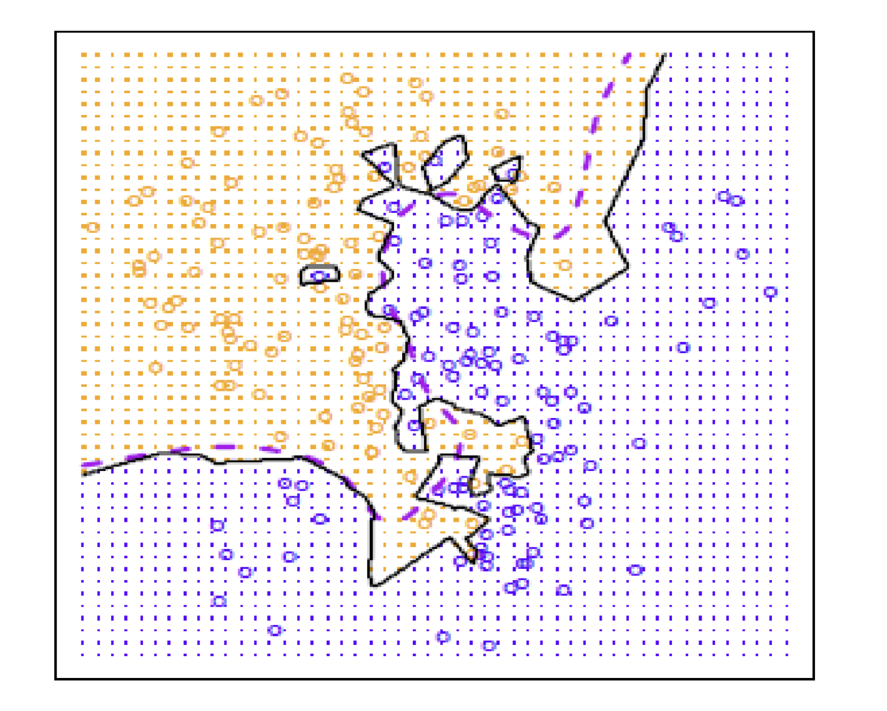
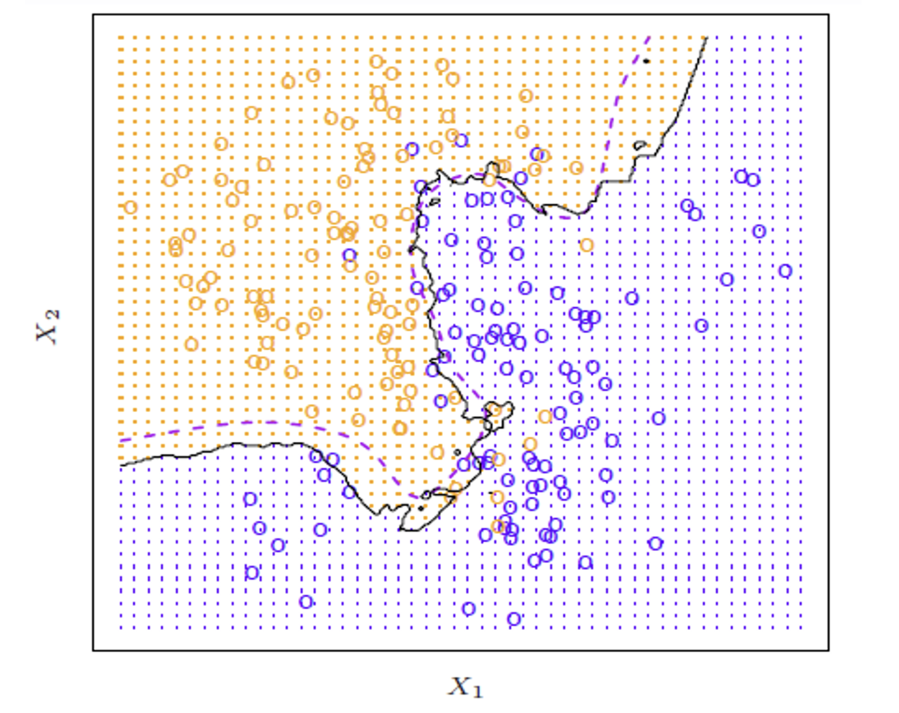

# Classification

## Naive Bayes
This is a parametric method that uses Bayes' theorem to predict the class of a new point.

It is based on the Bayes' theorem:

$$P(y|x) = \frac{P(x|y)P(y)}{P(x)}$$

It assumes that the features are independent given the class and are identically distributed.
Independent samples are samples that are drawn from the same distribution.

There are two types of classifiers:
- Discrete classifiers: assign a class label to a test instance
- Score classifiers: assign a continuous score for each class and can be assigned to a test instance.

An optimal Bayes rule assumes knowledge of:
- The prior distribution p(y)
- The distribution p(x|y) for each class y
- The distribution p(x)

Naïve Bayes classifier naively assumes that the input variables are conditionally independent. The function is:

Naïve Bayes can be a linear or non-linear method
for classification depending on the properties of
the input variables

Naïve Bayes does not have any parameter to
control the bias-variance trade-off. The only way
can be explicit feature selection

## Logistic Regression
Instead of prediction $Y$, we predict $P(Y=1|X)$ using the logistic (sigmoid) function:

$$P(Y=1|X) = \frac{e^{\beta_0 + \beta_1 X_1 + \beta_2 X_2 + ... + \beta_p X_p}}{1+e^{\beta_0 + \beta_1 X_1 + \beta_2 X_2 + ... + \beta_p X_p}}$$

For more than two classes we use the softmax function:

$$P(Y=k|X) = \frac{e^{\beta_{k0} + \beta_{k1} X_1 + \beta_{k2} X_2 + ... + \beta_{kp} X_p}}{\sum_{i=1}^K e^{\beta_{i0} + \beta_{i1} X_1 + \beta_{i2} X_2 + ... + \beta_{ip} X_p}}$$

We can estimate the parameter $\beta$ using maximum the likelihood function:

$$l(\beta_0, \beta) = \prod_{i=1}^n P(Y = y_i | x_i)$$

Where if $Y = 1$:
$$P(Y = y_i | x_i) = \frac{e^{\beta_0 + \beta_1 x_{i1} + \beta_2 x_{i2} + ... + \beta_p x_{ip}}}{1+e^{\beta_0 + \beta_1 x_{i1} + \beta_2 x_{i2} + ... + \beta_p x_{ip}}}$$

And if $Y = 0$:

$$P(Y = y_i | x_i) = \frac{1}{1+e^{\beta_0 + \beta_1 x_{i1} + \beta_2 x_{i2} + ... + \beta_p x_{ip}}}$$

**Summary**

Logistic regression is a parametric method for
classification.
Logistic regression is a linear method for
classification.
Logistic regression estimates class probabilities. It
does not make a classification decision; i.e. it is a
scoring classifier.
The variance of logistic regression can be reduced
using shrinkage methods based on ridge
regression (ridge logistic regression)

## Support Vector Machine
Support Vector Machines (SVMs) approach the two-
class classification problem in a direct way:
SVM try indeed to separate the classes in
instance space X.

Among all separating hyperplanes, find the one that makes
the biggest gap or margin between the two classes.

To convert SVM to a scoring classifier, we can use the decision function:

$$f(x) = \frac{1}{1+e^{Af(x)+B}}$$

where $A$ and $B$ are parameters that can be estimated using maximum likelihood.

Higher C values imply low flexibility (high bias, low variance).
Lower C values imply high flexibility (low bias, high variance).

**Summary**

SVM is a discrete classifier. It provides a classification
(no probability)!

SVM can be converted to a scoring classifier using
signed distance to hyperplane (directly or using the
Platt scaling)

SVM is a parametric method for binary classification.

SVM is a linear method for classification.

SVMs handle nonseparability problems using: Soft-margins and Kernels.


### Feature Expansion
Enlarge the feature space X by adding new features: $X^2$, $X^3$, $X_1 X_2$, ... 
Fit a support-vector classier in the enlarged space. This
results in non-linear decision boundaries in the original space.

### Kernel Support Vector Machine
We have a kernel function $K(x_i, x_j)$ that computes the similarity between $x_i$ and $x_j$. Then the decision function is:

$$f(x) = \beta_0 + \sum_{i=1}^n \alpha_i K(x_i, x)$$

## Decision Trees
Each interior node tests a variable
Each branch corresponds to an variable value
Each leaf node is labelled with a class (class node)

Pseudocode:

```python
def Classify(x: instance, node: variable containing a node of DT):
    if node is a classification node then
        return the class of node;
    else
        determine the child of node that match x.
return Classify(x, child).
```
It is okay for the training data to contain missing values decision trees can be used even if instances have missing
variables.

### Basic Algorithm:
1. X <- the “best" decision variable for a node N.
2. Assign X as decision variable for the node N.
3. For each value of X, create new descendant of the node N.
4. Sort training instances to leaf nodes.
5. IF training examples perfectly classified, THEN STOP.
ELSE iterate over new leaf nodes

**Entropy**
Let S be a sample of training examples, and
p+ is the proportion of positive examples in S and
p- is the proportion of negative examples in S.
Then: entropy measures the impurity of S
$$H(S) = -p_+ \log_2 p_+ - p_- \log_2 p_-$$

### Bias-Variance Tradeoff

Decision trees have in general high variance.
- The bias of decision trees decreases with the
size the trees.
- The variance of decision trees increases with
the size the trees.

### Overfitting

- Pre-pruning: stop growing the tree earlier,
before it reaches the point where it perfectly
classifies the training data
- Post-pruning: Allow the tree to overfit the
data, and then post-prune the tree.

Validation set is a set of instances used to evaluate the utility
of nodes in decision trees. The validation set has to be
chosen so that it is unlikely to suffer from same errors or
fluctuations as the training set.

**Summary**
DTs are discrete classifiers. They can estimate
probabilities by normalizing class scores in
each leaf node.
Decision Trees (DT) for a non-parametric
method for classification.
DTs are a non-linear method for classification.

## Decision Rules

Decision rules are rules with the following form:

```if {conditions} then concept C```

**Summary**
- Decision Rules (DRs) are discrete classifiers.
They can estimate probabilities by normalizing
class scores in each rule.
- Decision Rules form a non-parametric method
for classification.
- DRs are a non-linear method for classification.
- DRs are usually simpler than decision trees on
the same data.

## K-NN Classification
k-NN Classifier is a non-parametric classifier.
To estimate a class value y for a given test instance x, find
a set NN of the k closest instances to x in training data Tr.
- Discrete Classification: output the majority class among the
instances in NN.
- Scoring Classification: output the score for each class among
the instances in NN. If the scores are normalized we estimate
class probabilities.

The value of k controls the flexibility of the k-NN classi-
fier. The smaller that value the more flexible is the k-NN
classifier (the higher the variance and lower the bias)

Example K = 1:


Example K = 10:


- Continuous variables should be normalized.
Otherwise, the variables with bigger domains prevail!
- Discrete variables do not pose problems since
distances are based on value matches.

### Advantages
1. The NN classifier can estimate complex class borders
locally and differently for each new test instance;
2. The NN classifier provides good generalization
performance on many domains;
3. The NN classifier learns very quickly;
4. The NN classifier is robust to noisy training data;
5. The NN classifier is intuitive and easy to understand
which facilitates implementation and modification.

### Disadvantages
1. The NN classifier has large storage requirements
because it has to store all the data;
2. The NN classifier is slow during instance classification
because all the training instances have to be visited;
3. The generalization performance of the NN classifier
degrades with increase of noise in the training data;
4. The generalization performance of the NN classifier
degrades with increase of irrelevant variables.

**Summary**
- Nearest-Neighbor (NN) Classifier is a non-
parametric method for classification.
- NN is a non-linear method for classification.
- NN can be a discrete classifier and a scoring
classifier depending how we handle the class
statistics of the nearest neighbors.
- The bias-variance trade-off can be controlled
by the parameter k.
