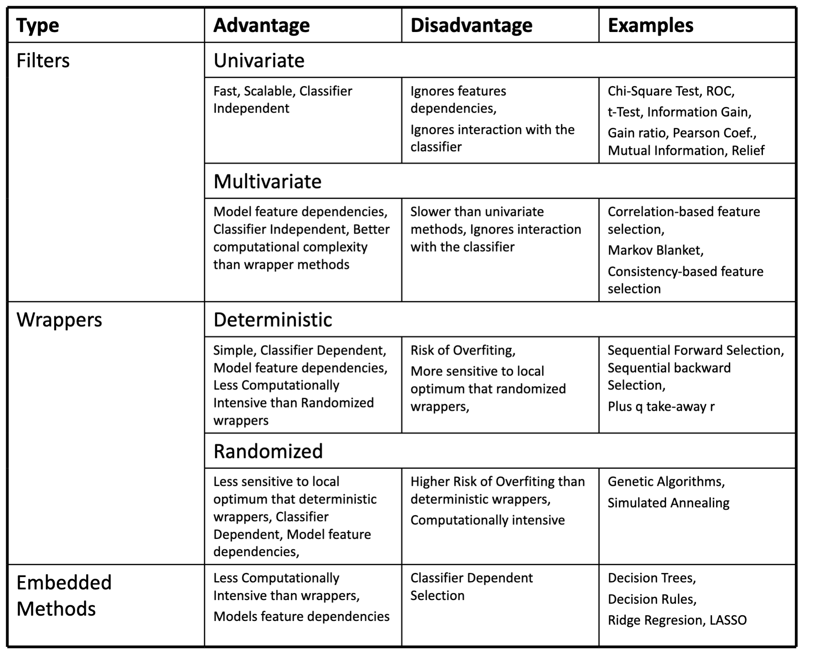
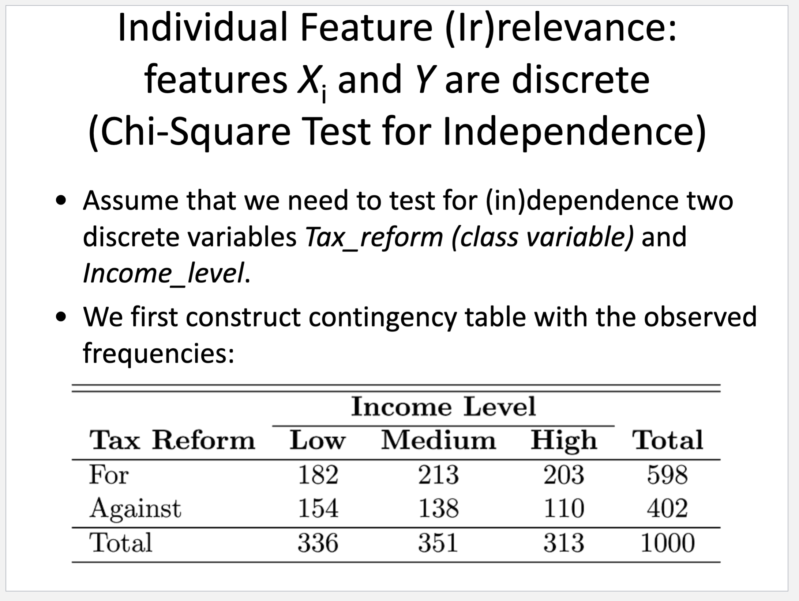
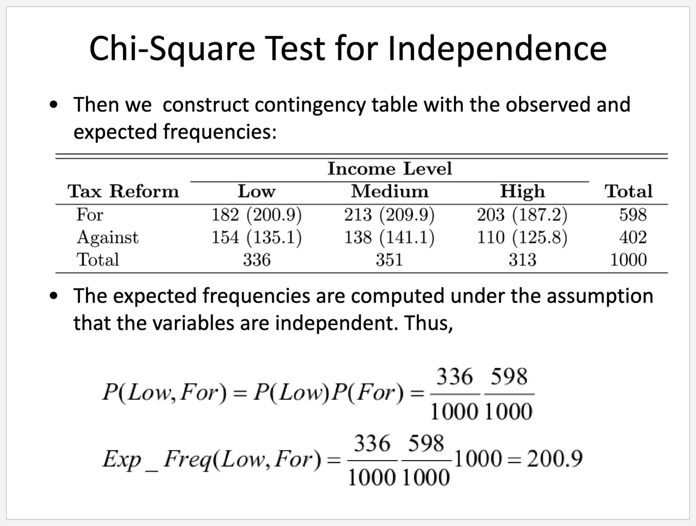

## Feature Selection

Given a supervised learning task, feature selection is a process of selecting features s.t. the generalization performance of the predictive models is improved.

Objectives:
- Avoid overfitting and improve generalization performance;
- Provide faster and more cost-effective models;
- Gain a deeper insight into the underlying processes that generated the data.

## Filters
Rank features or feature subsets independently of the learning algorithm (classifier).

- Advantages: Fast, Simple, Interpretable, Classifier independence, High dimensionality tolerance
- Disadvantages: Ignore interaction with classifiers, ignore feature dependencies.

## Univariate Filters

The relevance of individual feature $X_i$ is determined by how much
$X_i$ can explain the output feature $Y$. Statistically this means that we
need to assess the (in)dependence of $X_i$ and $Y$. In this context we
have two questions:

1. Is $X_i$ independent of $Y$?
2. If $X_i$ and $Y$ are not independent,
then how much are they dependent?

We have these scenarios:
- The feature $X_i$ is discrete and the feature $Y$ is discrete: Chi-
Square Test for Independence, ROC, Information gain and
Ratio; Relief; Mutual Information.
- The feature $X_i$ is continuous and the feature $Y$ is discrete: t-
Test on two means; Relief.
- The feature $X_i$ is continuous and the feature $Y$ is continuous:
Mutual Information.

Example:

## Multivariate Filters
Multivariate Filters rank feature subsets independently on the
type of the predictor later used.
Multivariate Filters operate by searching in the space of
possible feature subsets and choosing those of subsets that
maximize a given evaluation criterion

$N$ features, $2^N$ possible feature subsets

**Search**
- Search Direction: Forward, Backward, Bidirectional
- Search Strategy: 
  - Deterministic: Hill Climbing, Best First, Exhaustive
  - Non-deterministic: Genetic

**Feature Subset Assessment**
Split the data into 3 subsets: training, validation, and test.
1. For each feature subset, train
predictor on training data.
2. Select the feature subset, which
performs best on validation data.
Repeat and average if you want to reduce
variance (cross-validation).
3. Test on test data.

**Data Leakage**
Data leakage in validation occurs when information
from outside the training fold is used—directly or
indirectly—during model training or preprocessing,
causing the model to appear more accurate in
evaluation than it really is.

### Correlation Based Feature Selection
Evaluation of feature subsets based on the next formula:

$$\text{CFS}(X_i, Y) = \frac{kr_{cf}}{\sqrt{k + (k-1)r_{ff}}}$$

where $S$ is a set with $k$ features, $r_{cf}$ is the average
correlation between the features in $S$ and the class
feature, and $r_{ff}$ is the average correlation between the
features in $S$.

## Wrappers
Wrappers rank feature subsets w.r.t. the predictor used.
Wrappers operate by searching in the space of possible
feature subsets and choosing those of subsets that
maximize a given evaluation criterion based on the
predictor later used.
The evaluation method of the classifier for feature evaluation
usually is k-fold cross validation.

**Recursive Feature Elimination**: 

Recursive Feature Elimination is a wrapper that recursively reduces
the set of features by eliminating the least important ones based on
the ranking provided by a specific model.

- Feature Dependency: RFE takes into account the
feature dependency assuming that are incorporated in
the ranks.
- Feature Ranking: Not only does RFE help in selecting
important features, but it also ranks all features based
on their importance.
- Handles Multicollinearity: If some features are
correlated, RFE can help in identifying and retaining the
most important one among them.
- Flexibility: RFE can be used with any model that assigns
weights or importance to features, making it versatile.
- Computationally Intensive: As RFE involves training the
model multiple times (once for each feature), it can be
computationally expensive.
- Model Dependency: The effectiveness of RFE is tied to the
chosen model. A poorly chosen model might lead to sub-
optimal feature selection.
- Stability Issues: Slight changes in the data can lead to
different rankings, especially when features have similar
importance.
- Base Model Selection: The choice of the model used in RFE is
crucial. It's advisable to use a model that naturally provides
importance or coefficient values, like decision trees, linear
regression, or support vector machines.

## Embedded Methods
White box predictors are actually based on
feature selection. So,
Embedded methods are all the learning
algorithms that derive white box predictors.
These include:
Decision trees and rules, and Shrinkage methods such as ridge regression and LASSO.
