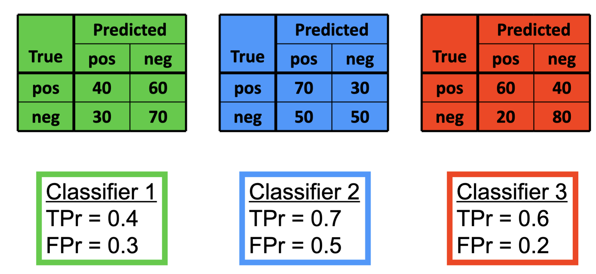
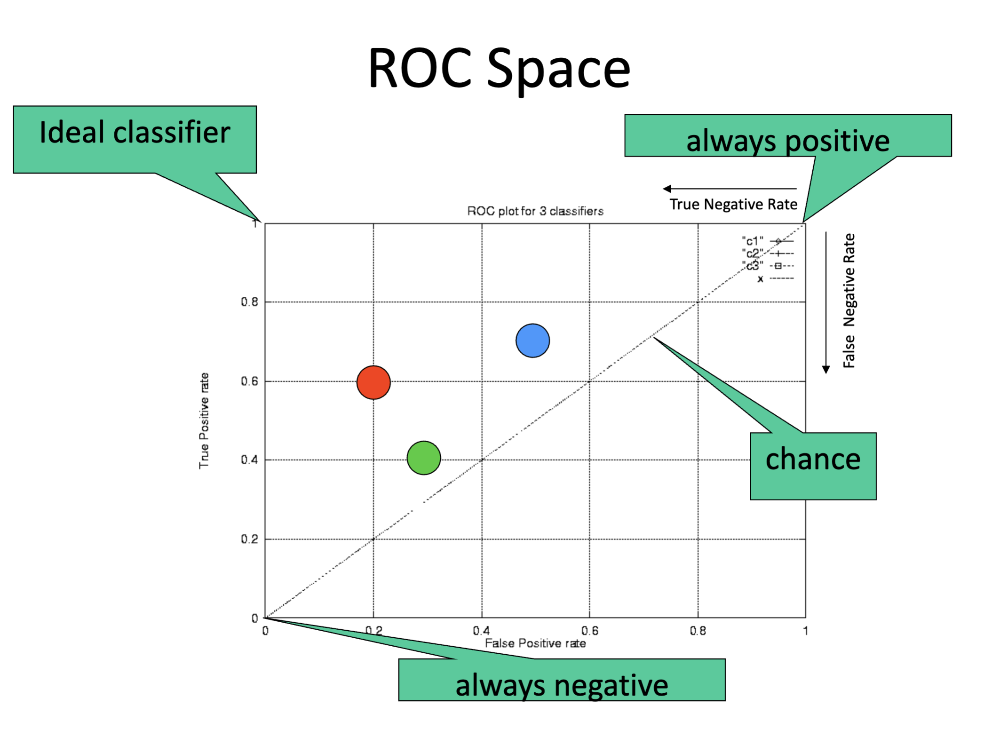

# Model Validation

How to validate classifier performance? We use the following confusion matrix (table):

| Actual/Predicted | Pos | Neg |
| --- | --- | --- |
| Pos | TP | FP |
| Neg | FN | TN |

Metrics:
- Accuracy: $(TP+TN)/(TP+FP+FN+TN)$
- Precision: $(TP)/(TP+FP)$
- Recall: $(TP)/(TP+FN)$
- Error: $(FP+FN)/(TP+FP+FN+TN)$
- F1: $FP/(FP+TN)$

Estimation with independent test data is used when
we have plenty of data and there is a natural way to
forming training and test data

## K-fold Cross Validation
k-fold cross-validation avoids overlapping test
sets:

- First step: data is split into k subsets of equal size
- Second step: each subset in turn is used for testing
and the remainder for training
- The subsets are stratified
before the cross-validation

## Leave-one-out Cross Validation
Leave-One-Out is a particular form of
cross-validation:
- Set number of folds to number of training
instances;
- I.e., for n training instances, build classifier n
times.
- Makes best use of the data.
- Involves no random sub-sampling.
- Very computationally expensive.
A disadvantage of Leave-One-Out-CV is
that stratification is not possible:
- It guarantees a non-stratified sample
because there is only one instance in the test
set!
- Extreme example - random dataset split
equally into two classes:
- Best inducer predicts majority class;
- 50% accuracy on fresh data;
- Leave-One-Out-CV estimate is 100% error!

## Bootstrap
Cross validation uses sampling without
replacement:
- The same instance, once selected, can not be
selected again for a particular training/test set
- The bootstrap uses sampling with replacement
to form the training set:
- Sample a dataset of n instances n times with
replacement to form a new dataset of n instances;
- Use this data as the training set;
- Use the instances from the original dataset that
don’t occur in the new training set for testing.

## Metric Evaluation

- Use test sets and the hold-out method for
“large” data;
- Use the cross-validation method for “middle-
sized” data;
- Use the leave-one-out and bootstrap
methods for small data;
- Don’t use test data for parameter tuning -
use separate validation data.

### Cost Sensitive Classification

Expected cost is calculated the next table:

| Actual/Predicted | Pos | Neg |
| --- | --- | --- |
| Pos | $c_{tp}$ | $c_{fn}$ |
| Neg | $c_{fp}$ | $c_{tn}$ |

Assume that the classifier returns for an instance $p_{pos} = 0.6$ and $p_{neg} = 0.4$. Then, the expected cost if the instance is classified as positive is $0.6 * 0 + 0.4 * 10 = 4$. The expected cost if the instance is classified as negative is $0.6 * 5 + 0.4 * 0 = 3$. To minimize the costs the instance is classified as negative.

### ROC Curves

Dominance in ROC space
Classifier A dominates classifier B if it is always better or equal to classifier B. It means: 
$TPR_A >= TPR_B$ and $FPR_A <= FPR_B$

Where $TPR$ is the true positive rate and $FPR$ is the false positive rate.

$TPR = TP / (TP + FN)$

$FPR = FP / (FP + TN)$

## What a ROC curve shows

A ROC curve visualizes how well a binary classifier separates two classes (positive vs. negative) as you vary the decision threshold.

It plots:

x-axis: False Positive Rate (FPR)

y-axis: True Positive Rate (TPR, a.k.a. recall or sensitivity)

Each point on the curve corresponds to one possible threshold on the classifier’s output score (probability or confidence).

🔹 2. Definitions

For each threshold 
𝑡
t:

Metric	Formula	Meaning
TP	# predicted positive and actually positive	True Positives
FP	# predicted positive and actually negative	False Positives
FN	# predicted negative and actually positive	False Negatives
TN	# predicted negative and actually negative	True Negatives

Manual Construction Example

Let’s imagine you have a model that outputs probabilities for 6 samples:

| Sample | True Label | Predicted Prob |
| --- | --- | --- |
| 1 | 1 | 0.9 |
| 2 | 0 | 0.8 |
| 3 | 1 | 0.7 |
| 4 | 0 | 0.6 |
| 5 | 1 | 0.4 |
| 6 | 0 | 0.2 |

Step 1️⃣ — Sort samples by predicted probability (descending)
0.9, 0.8, 0.7, 0.6, 0.4, 0.2

Step 2️⃣ — Sweep a threshold from high → low

| Threshold | TP | FP | TN | FN | TPR | FPR |
| --- | --- | --- | --- | --- | --- | --- |
| >0.9 | 0 | 0 | 3 | 3 | 0.00 | 0.00 |
| >0.8 | 1 | 0 | 3 | 2 | 0.33 | 0.00 |
| >0.7 | 1 | 1 | 2 | 2 | 0.33 | 0.33 |
| >0.6 | 2 | 1 | 2 | 1 | 0.67 | 0.33 |
| >0.4 | 2 | 2 | 1 | 1 | 0.67 | 0.67 |
| >0.2 | 3 | 2 | 1 | 0 | 1.00 | 0.67 |
| >0.0 | 3 | 3 | 0 | 0 | 1.00 | 1.00 |

Step 3️⃣ — Plot (FPR, TPR)

Points:
(0.00, 0.00), (0.00, 0.33), (0.33, 0.33), (0.33, 0.67), (0.67, 0.67), (0.67, 1.00), (1.00, 1.00)

Connecting these points gives your ROC curve.

🔹 4. AUC (Area Under the Curve)

The AUC measures how good your model is overall:

AUC = 1 → perfect model

AUC = 0.5 → random guessing

AUC < 0.5 → worse than random